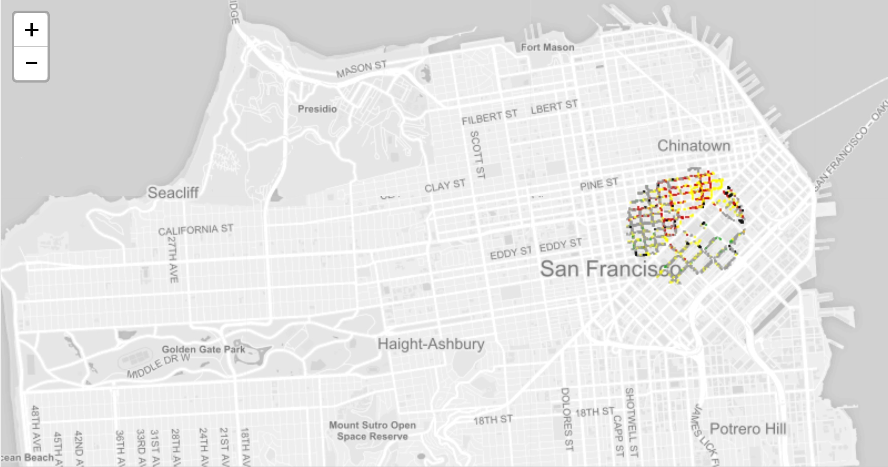
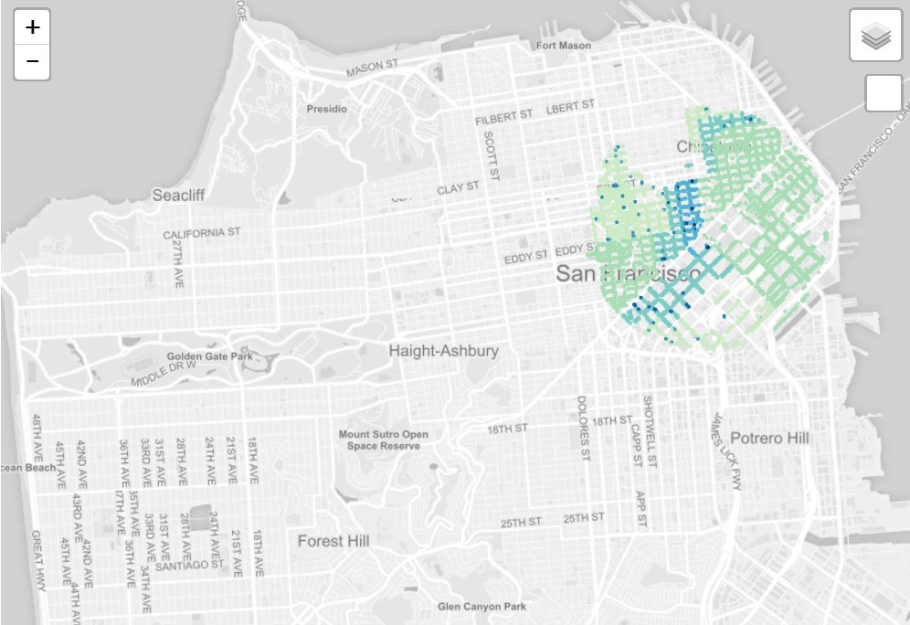

# d3_mapping

## Mapping with d3 and leaflet.

Data: San Francisco Parking Meters

### Leaflet + D3 (v4) + Canvas

[Source Code](https://github.com/kristin-henry-sf/d3_mapping/tree/master/sfParkingMetersMap_d3v4_canvas) | [Block](http://bl.ocks.org/kristin-henry-sf/2ffa2a4d06412db552f627b48b85cf97)
* faster rendering with Canvas instead of SVG
* original data set is too big. Wrote python script to get subset.

### Leaflet + D3 (v4)

[Source Code](https://github.com/kristin-henry-sf/d3_mapping/tree/master/sfParkingMetersMap_d3v4) | [Block](http://bl.ocks.org/kristin-henry-sf/4544f810940e353ac3f362497f763246)
* migrated to Version 4 of D3
* still using SVG elements to represent data points
* original data set is too big. Wrote python script to get subset.

### Leaflet + D3 (v3)

[Source Code](https://github.com/kristin-henry-sf/d3_mapping/tree/master/sfParkingMetersMap) | [Block](http://bl.ocks.org/kristin-henry-sf/8a45fead6d97e90519c80f454e9fb461)
* using SVG elements to represent data points
* original data set is too big. Wrote python script to get subset.

